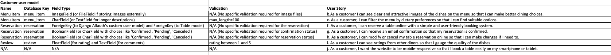
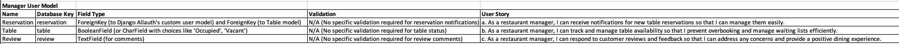
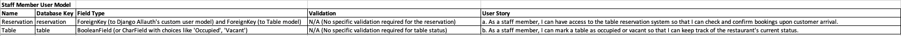
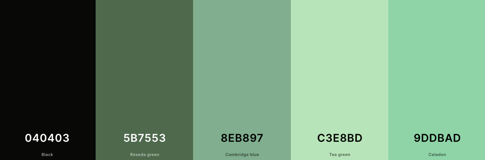
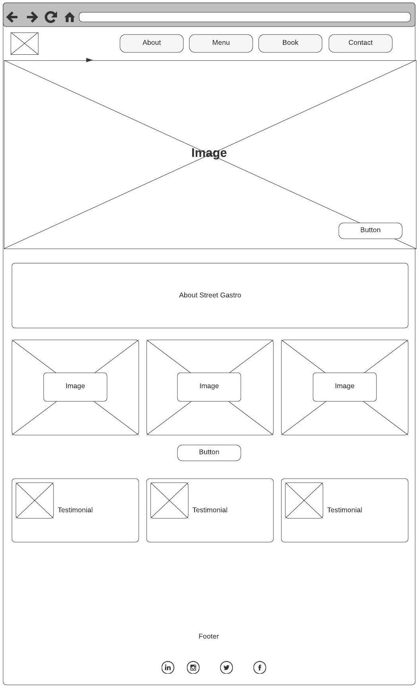
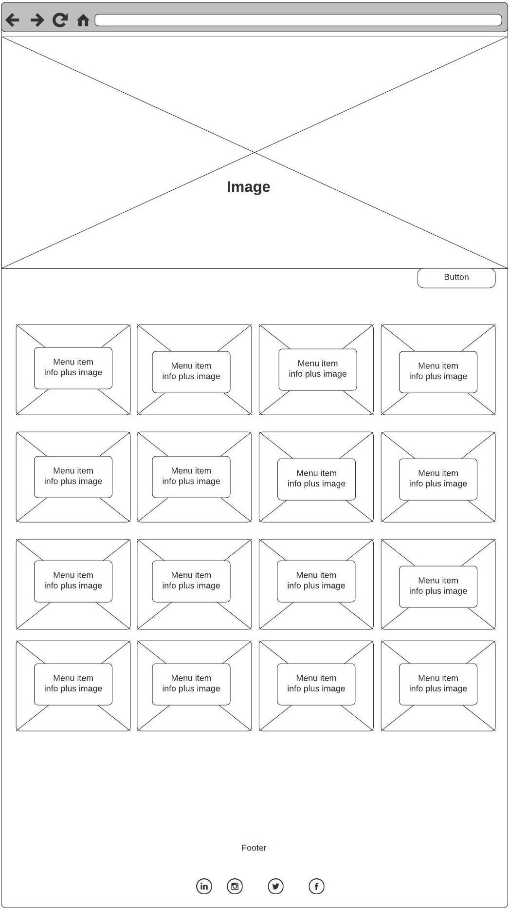
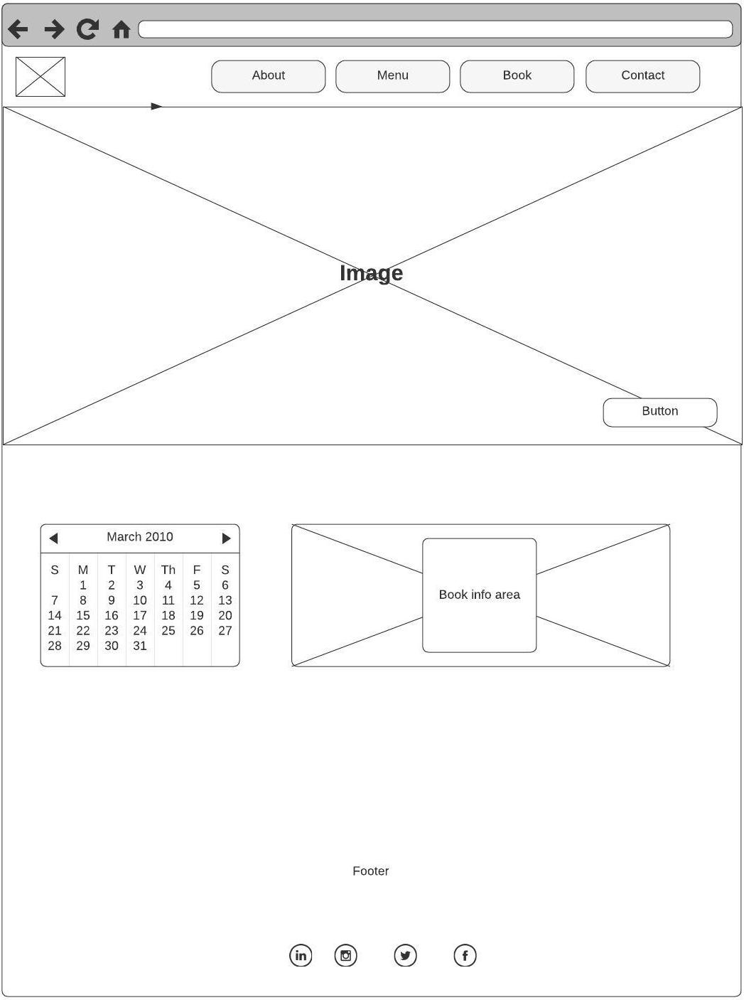
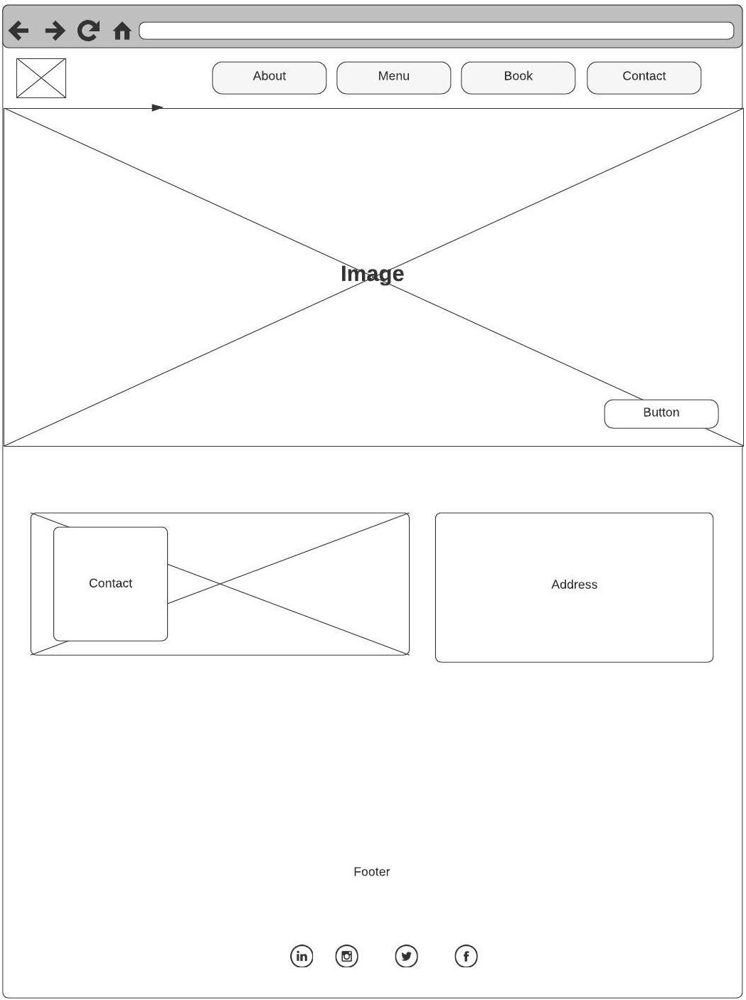

# Street Gastro Restaraunt Booking App

## About

The live website can be accessed by visiting this [link](#).

The website Street Gastro a comprehensive restaurant and table booking platform that aims to provide a seamless and enjoyable experience for both customers and restaurant staff. It will serve as an online hub for the restaurant, offering various functionalities to enhance the dining process and facilitate table reservations.

## User Experience Design

### Strategy

Build a user-friendly restaurant and table booking website using Django Allauth and Python. The website allows customers to browse the menu, make table reservations, and leave star ratins on indivudual dishes. Utilize Django's models and database relationships to ensure efficient data management.

### Target Audience

The target audience for the restaurant and table booking website includes both potential customers looking for a dining experience and restaurant staff or management responsible for handling table reservations. The website aims to cater to diners seeking convenient online table bookings and menu exploration while providing restaurant personnel with with a simple task manger for guest and tables booked.

### User Stories

#### Customer Goals

- As a customer I can see clear and attractive images of the dishes on the menu so that I can make better dining choices.
- As a customer I can filter the menu by dietary preferences so that I can find suitable options.
- As a customer I can reserve a table online with a simple and user-friendly booking system.
- As a customer I can receive an email confirmation so that my reservation is confirmed.
- As a customer I can edit or cancel my table reservation online so that can make changes if I need to.
- As a customer I can see star ratings from other diners so that I gauge the restaurant's quality.
- As a customer, I want the website to be mobile-responsive so that I book a table easily on my smartphone or tablet.

#### Manager and Staff Goals

- As a staff/manager member I can have access to the table reservation task manager so that I can check how many guests and tables are booked for that day

## Technologies used
- ### Languages:
    + [Python](https://www.python.org/downloads/release/python-385/): the primary language used to develop the server-side of the website.
    + [JS](https://www.javascript.com/): the primary language used to develop interactive components of the website.
    + [HTML](https://developer.mozilla.org/en-US/docs/Web/HTML): the markup language used to create the website.
    + [CSS](https://developer.mozilla.org/en-US/docs/Web/css): the styling language used to style the website.
- ### Frameworks and libraries:
    + [Django](https://www.djangoproject.com/): python framework used to create all the backend logic of the website.
    + [jQuery](https://jquery.com/): was used to control click events and sending AJAX requests.
    + [jQuery User Interface](https://jqueryui.com/) was used to create interactive elements and animations.
    + [Django Channels](https://channels.readthedocs.io/en/latest/): was used to create real-time communication between users.
- ### Databases:
    + [Elephantsql](https://www.elephantsql.com/): the database used to store all data.

  
## Features

**Interactive Menu**
- The website will showcase an interactive and visually appealing menu, displaying dishes with high-quality images and detailed descriptions. 
- Customers can easily browse through the menu to explore various food options.

**Table Booking System**
- The core functionality of the website will be a user-friendly table booking system. 
- Customers can select their desired date and time, see available tables, and make reservations for a specific number of guests.

**Real-time Availability**
- The website will have real-time updates on table availability, ensuring that customers can view up-to-date information and make informed decisions while booking.

**Special Requests and Preferences**
- During the reservation process, customers can include any special requests or preferences, such as dietary restrictions or special occasions, so the restaurant can accommodate their needs accordingly.

**User Reviews and Ratings**
- The website will feature customer reviews and ratings, providing valuable feedback for potential diners and showcasing the restaurant's reputation.

**Operating Hours and Location**
- Customers can easily find information about the restaurant's operating hours, address, and contact details on the website.

**Mobile Responsiveness**
- The website will be fully responsive to different devices, including smartphones and tablets, allowing customers to access it on the go.

**Reservation Confirmation and Reminders**
- After booking a table, customers will receive instant confirmation via email or SMS. Additionally, the website can send automated reminders closer to the reservation time.

**Staff Management Interface**
- The website will provide a backend interface for restaurant staff to manage table reservations, check-in guests, and update table status (occupied or vacant).

**Customer Support**
- The website will offer customer support options, such as a contact form, allowing customers to get assistance with their inquiries or issues.

**Security and Privacy**
- The website will prioritize data security and ensure that customer information is protected throughout the booking process.

**Social Media Integration**
- The website can be linked to the restaurant's social media accounts, making it easy for customers to share their dining experiences and reviews.

**Overall**
- The website will serve as an efficient and user-friendly platform, streamlining the table booking process for customers and providing restaurant staff with tools to manage reservations effectively. 
- The goal is to create a positive and convenient dining experience that encourages repeat visits and word-of-mouth recommendations.

## Information Architecture

### Database

- During the earliest stages of the project, the database was created using ElephantSQL.

### Data Modeling

**Relationship diagram**

1. **Allauth User Model**
    - The user model was created using [Django-allauth](https://django-allauth.readthedocs.io/en/latest/).
    - The user model was then migrated to PostgreSQL.

2. **Customer User Model**

3. **Manager User Model**
   

4. **Staff Member User Model**

## Design

### Color Scheme

- The color scheme of the application is based on the dark black, greens and light green colors:

- The decision to use this color palette was made to give it a natural warm restaurant feel.

### Wireframes ###

**Home**

**Menu**

**Book**

**Contact**

