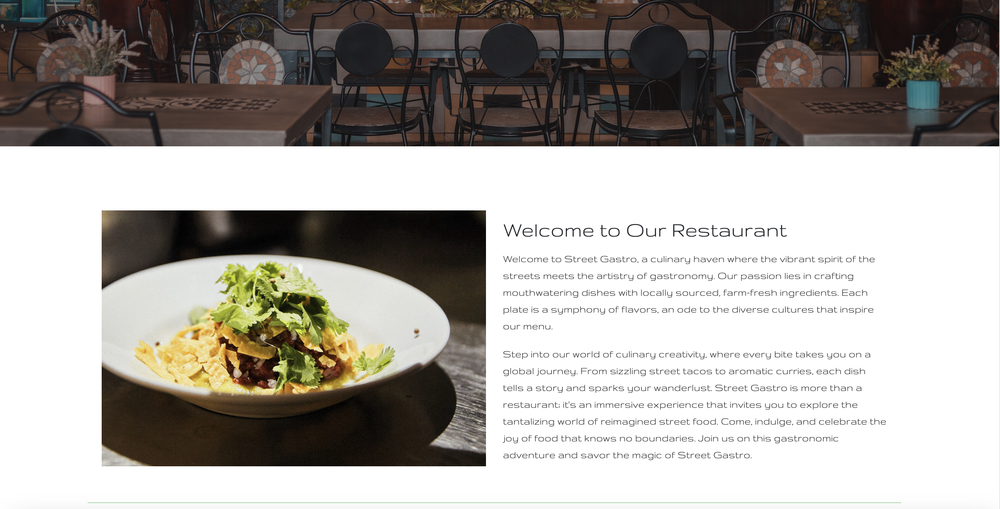
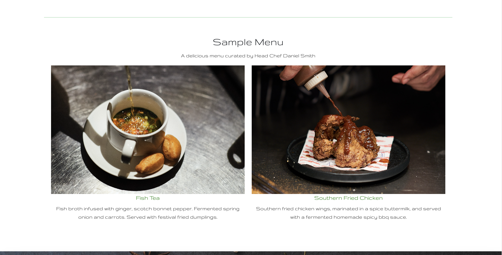
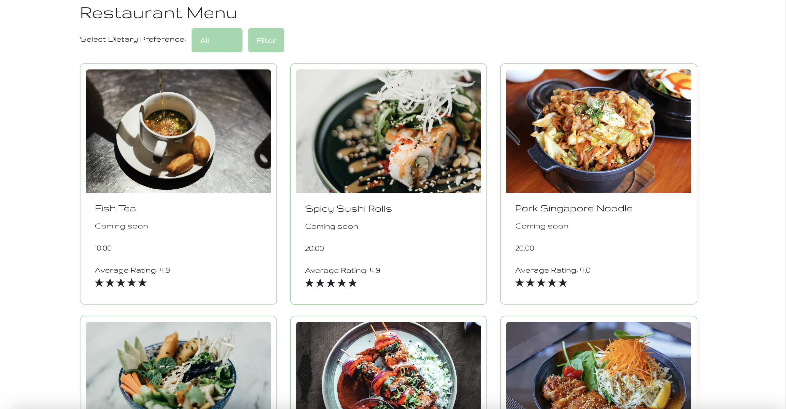
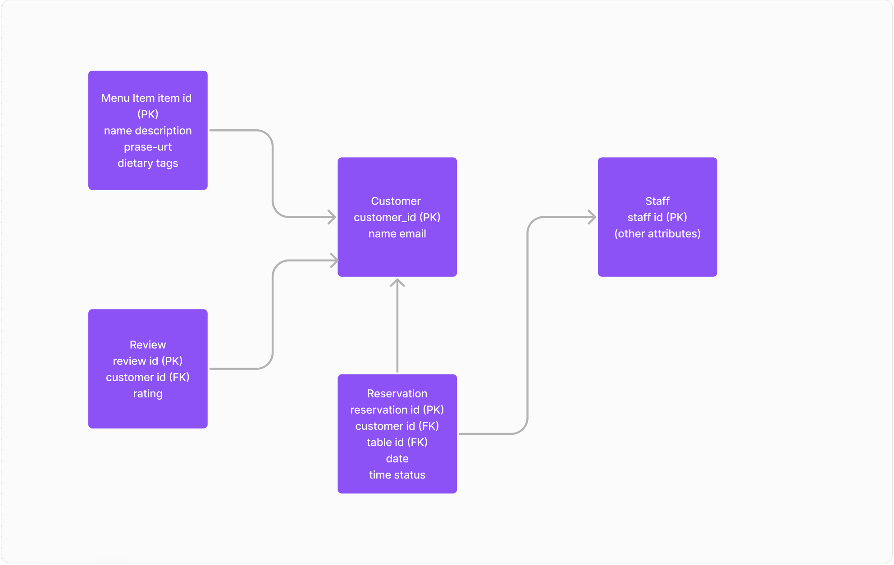
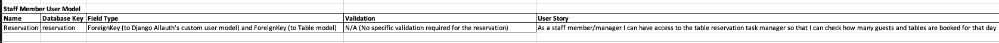
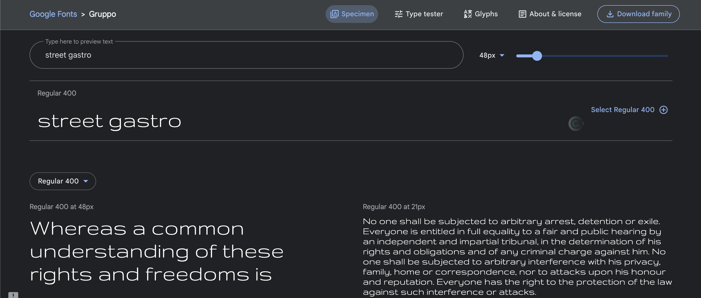

# Street Gastro Restaraunt Booking App


## About

The live website can be accessed by visiting this [link](https://street-gastro-13c2e136005c.herokuapp.com/). 

The live task manager website can be accessed by visiting this [link](https://street-gastro-13c2e136005c.herokuapp.com/task_manager/tasks/).

The website Street Gastro a comprehensive restaurant and table booking platform that aims to provide a seamless and enjoyable experience for both customers and restaurant staff. It will serve as an online hub for the restaurant, offering various functionalities to enhance the dining process and facilitate table reservations.

## User Experience Design

### Strategy

Build a user-friendly restaurant and table booking website using Django Allauth and Python. The website allows customers to browse the menu, make table reservations, and leave star ratins on indivudual dishes. Utilize Django's models and database relationships to ensure efficient data management.

### Target Audience

The target audience for the restaurant and table booking website includes both potential customers looking for a dining experience and restaurant staff or management responsible for handling table reservations. The website aims to cater to diners seeking convenient online table bookings and menu exploration while providing restaurant personnel with with a simple task manger for guest and tables booked.

### User Stories

#### Customer Goals

- As a customer I can see clear and attractive images of the dishes on the menu so that I can make better dining choices.
- As a customer I can filter the menu by dietary preferences so that I can find suitable options.
- As a customer I can reserve a table online with a simple and user-friendly booking system.
- As a customer I can receive an email confirmation so that my reservation is confirmed.
- As a customer I can edit or cancel my table reservation online so that can make changes if I need to.
- As a customer I can see star ratings from other diners so that I gauge the restaurant's quality.
- As a customer, I want the website to be mobile-responsive so that I book a table easily on my smartphone or tablet.

#### Manager and Staff Goals

- As a staff/manager member I can have access to the table reservation task manager so that I can check how many guests and tables are booked for that day


## Technologies used

- ### Languages:
    + [Python](https://www.python.org/downloads/release/python-385/): the primary language used to develop the server-side of the website.
    + [JS](https://www.javascript.com/): the primary language used to develop interactive components of the website.
    + [HTML](https://developer.mozilla.org/en-US/docs/Web/HTML): the markup language used to create the website.
    + [CSS](https://developer.mozilla.org/en-US/docs/Web/css): the styling language used to style the website.
- ### Frameworks and libraries:
    + [Django](https://www.djangoproject.com/): python framework used to create all the backend logic of the website.
    + [jQuery](https://jquery.com/): was used to control click events and sending AJAX requests.
    + [jQuery User Interface](https://jqueryui.com/) was used to create interactive elements and animations.
    + [Django Channels](https://channels.readthedocs.io/en/latest/): was used to create real-time communication between users.
- ### Databases:
    + [Elephantsql](https://www.elephantsql.com/): the database used to store all data.


  
## Features


**Hero Section**
- The user is welcomed by the ambieance of the restaraunt in the hero image. With clear call to action buttons to book a table or browse the menu dish images and see the star ratings for each dish.
  


**Welcome Section**
- When scrolling down there is a nice and invitin welsome section. Withe a nice presentation about the restarant and elegant image of a dish.
  


**Sample Menu Section**
- When scrolling further the user is presented with to sample dishes and description from the menu.
  


**Booking Section**
- when scrolling the user is preneted with a beautifull booking section.
- Clear call to action to book a table.
- Booking form with name, email, geusts, date. 
- Book button, edit button and cancel button. 


**Gallery Section**
- Scroll further and the user is presented with a roatating gallery. also a prenetation on the ethos of Street gastro and localy sourced produce.



**Interactive Menu**
- The website will showcase an interactive and visually appealing menu, displaying dishes with high-quality images and detailed descriptions. 
- Customers can easily filter through the menu to explore various food options.
- The customer can also rate dishes with a 1 - 5 star rating. view the average rating for each dish.

**Mobile Responsiveness**
- The website will be fully responsive to different devices, including smartphones and tablets, allowing customers to access it on the go.

**Reservation Confirmation and Reminders**
- After booking a table, customers will receive instant confirmation via email. Additionally.

**Staff Management Interface**
- The website will provide atask manager for restaurant staff to see how many guests and tables are booked for that day.

**Overall**
- The website will serve as an efficient and user-friendly platform, streamlining the table booking process for customers and providing restaurant staff with tools to manage reservations effectively. 
- The goal is to create a positive and convenient dining experience that encourages repeat visits and word-of-mouth recommendations.

## Information Architecture

### Database

- During the earliest stages of the project, the database was created using ElephantSQL.

### Data Modeling

**Relationship diagram**



1. **Allauth User Model**
    - The user model was created using [Django-allauth](https://django-allauth.readthedocs.io/en/latest/).
    - The user model was then migrated to PostgreSQL.

2. **Customer User Model**


3. **Staff Member User Model**




## Design


### Color Scheme

- The color scheme of the application is based on the dark black, greens and light green colors:


- The decision to use this color palette was made to give it a natural warm restaurant feel.

### Typography

The main font used in the website is Gruppo. The use of this font is consistent with style and elegance of the restaraunt. Needless to say, the Gruppo font was chosen due to its readability, which increases user experience.

  


### Imagery

- The main background image waswas found at pexels.com [Pexels](https://www.pexels.com). All other images was found on pexels or my own personal images.

### Wireframes ###

**Home**


**Menu**


**Book**


**Contact**


---
## Testing
Please refer to the [TESTING:MD](https://github.com/KristianDsmith/project-4/blob/main/TESTING.md) file for all test-related documentation.
---
## Deployment

**The app was deployed to Heroku**

- The app was deployed to [heroku](https://heroku.com/).
- The database was deployed to [ElephantSQL](https://www.elephantsql.com/).

- The app can be reached by the [link](#).

### Heroku

The process for deploying the website to Heroku is as follows:

1. Create a Heroku account if you don't already have one.

2. Create a new app on Heroku.

    1. Go to the [Heroku dashboard](https://dashboard.heroku.com/apps).
    2. Click on the "New" button.
    3. Click on the "Create new app" button.
    4. Choose a name for your app.
    5. Choose a region.
    6. Click on the "Create app" button.

3. In your app go to the "Resources" tab.

    1. Add a Heroku Postgres database.
    2. Add a Heroku Redis database (heroku may ask you for your credit card details, but won't charge).

4. In your app go to the "Settings" tab, press "Reveal Config Vars", and add the following config vars if they are not already set:

    1. ```ALLOWED_HOSTS``` = your heroku domain name.
    2. ```CLOUDINARY_CLOUD_NAME``` = the cloud name you used when creating your cloudinary account.
    3. ```CLOUDINARY_API_KEY``` = the api key you got when created your cloudinary account.
    4. ```CLOUDINARY_API_SECRET``` = the api secret you got when created your cloudinary account.
    5. ```DATABASE_URL``` = the url of your myelaphant sql postgres database.
    6. ```SECRET_KEY``` = a secret key for your app.
    7. ```EMAIL_HOST_USER``` = the email address you going to use to send emails.
    8. ```EMAIL_HOST_PASS``` = the password for the email address you are using.
    9.  ```DEBUG``` = True during development, False during production.
    10. ```DISABLE_COLLECTSTATIC``` = 1 during development. Remove this when deploying to production.

5. In your app go to the "Deploy" tab.

    1. If it's already possible, connect your Heroku account to your GitHub account and then click on the "Deploy" button.
    2. If not, you need to copy the Heroku CLI command to connect your heroku app and your local repository.

        - ```heroku git:remote -a <your-heroku-app-name>```

6. Go to your local repository.

7. Login to your Heroku account in your terminal and connect your local repository to your heroku app.

    1. ```heroku login -i``` - Enter all your Heroku credentials it will ask for.
    2. Paste the command you copied from step 5 into your terminal.

8. Create Procfile.

    - Create a procfile in the IDE 
    - Add web: gunicorn streetgastro.wsgi

9.  Create ```requirements.txt```. This can be done by running the following command:

    - ```pip freeze > requirements.txt```
    or
    - ```pipreqs requirements.txt``` - if you have pipreqs installed.

10. Add and commit all changes.

11. Push your changes to Heroku.

    - ```git push heroku master```
    or
    - ```git push heroku main```

12. Check the logs of your app in heroku dashboard and make sure everything is working.

5.  After the development is done, you can change the ```DEBUG``` config var to ```False``` and remove the ```DISABLE_COLLECTSTATIC``` config var from the config vars on heroku.

To get cloudinary cloud name, api key, and api secret:

1. Go to the [Cloudinary website](https://cloudinary.com/).

2. Log in to your account or sign up if you don't have an account.

3. Go to the [Cloudinary dashboard](https://cloudinary.com/console/).

4. At the top of the page you will see your cloud name, api key, and api secret.

5. To reveal api secret, hover over the api key container and click on the button that looks like an eye.

6. Copy these values and paste them into the config vars on heroku and into your `env.py` file.


#### Create Database on ElephantSQL

1. Go to [ElephantSQL](https://www.elephantsql.com/) and create a new account.

2. Create a new instance of the database.

3. Select a name for your database and select the free plan.

4. Click "Select Region"

5. Select a region close to you.

6. Click "Review"

7. Click "Create Instance"

8. Click on the name of your database to open the dashboard.

9. You will see the dashboard of your database. You will need the URL of your database to connect it to your Django project.


## Credits
- [Django](https://www.djangoproject.com/) for the framework.
- [Django-allauth](https://django-allauth.readthedocs.io/) for the authentication library.
- [Font awesome](https://fontawesome.com/): for the free access to icons.
- [ElephantSQL](https://www.elephantsql.com/): for the free access to the database hosting service.
- [Cloudinary](https://cloudinary.com/): for the free access to the image hosting service.
- [jQuery](https://jquery.com/): for providing varieties of tools to make standard HTML code look appealing.
- [jQuery UI](https://jqueryui.com/): for providing various tools to make interactive HTML code look appealing.
- [Coolors](https://coolors.co/): for providing a free platform to generate your own palette.
- [Google Fonts](https://fonts.google.com/): for providing a free platform to use Google Fonts.
---