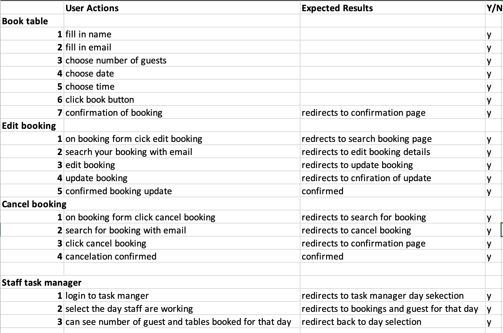
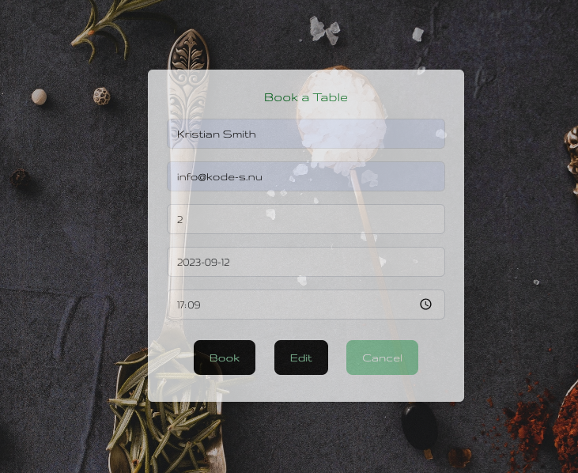
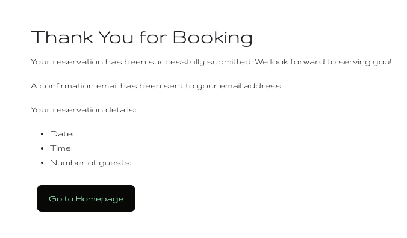
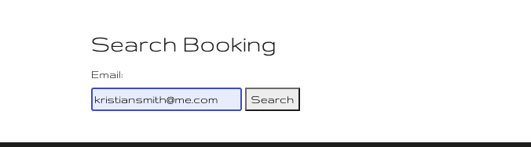
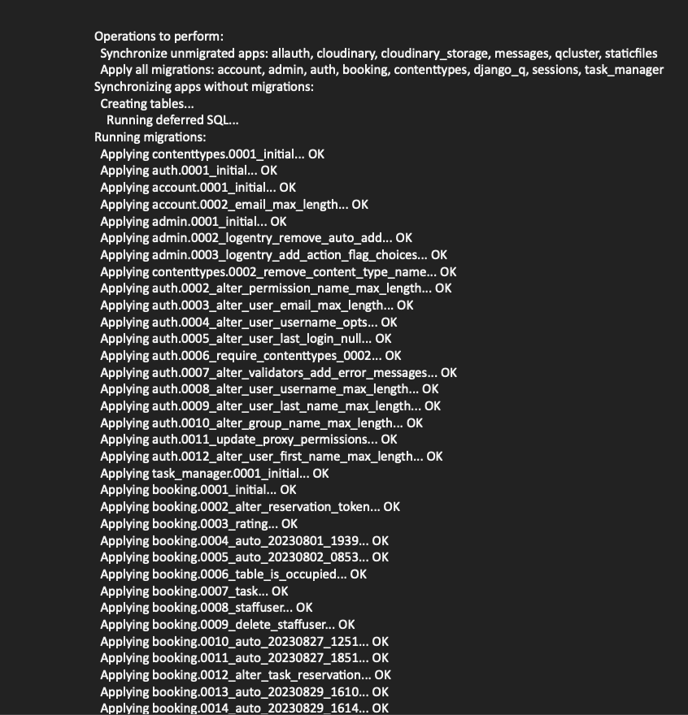
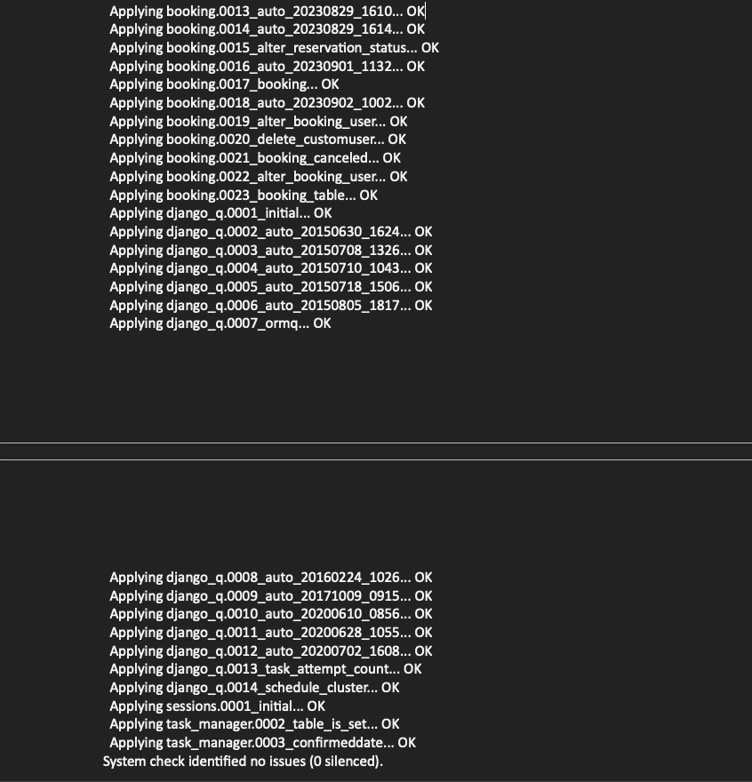

# Street Gastro Restaraunt Booking App

## Manual Testing

- Testing was done throughout site development, for each feature before it was merged into the master file.

- Usability was tested with the below user acceptance testing, sent to new users to ensure testing from different users, on different devices and browsers to ensure issues - were caught and where possible fixed during development.

- Book, Edit, Cancel bookings from booking form.

- Booking confirmed.
  

- Search booking with email.
  

## Automated testing

### Django unit testing

Django unit testing is a framework that allows you to write tests for your Django application. It is a good way to test your application's functionality and to make sure that your code is working as expected. 

## Validation

### HTML Validation:

- HTML validation was done by using the official [W3C](https://validator.w3.org/) validator. This checking was done manually by copying the view page source code (Ctrl+U) and pasting it into the validator.

- [Full HTML Validation Report](documentation/validation/html_validation.pdf)

- There were errors and warnings about duplicated IDs on pages, where there's a posting and commenting functionality. That occurred because of the fact that multiple comment forms were on the same page, under each post. However, this does not affect the functionality of the app, because each comment form is processed separately.

### CSS Validation:

- [Full CSS Validation Report](documentation/validation/css_validation.png)

- No errors or warnings were found when passing through the official [W3C (Jigsaw)](https://jigsaw.w3.org/css-validator/#validate_by_uri) validator except for the warnings about the use of css root variables and webkit css rules for the box-shadow. However, css code works perfectly on various devices.

### JS Validation:

- [JS Validation Report. base.js](documentation/validation/js_validation_base_js.png)
- [JS Validation Report. chatRoom.js](documentation/validation/js_validation_chatroom.png)
- [JS Validation Report. notifications.js](documentation/validation/js_validation_notifications.png)

- No errors or warning messages were found when passing through the official [JSHint](https://www.jshint.com/) validator. However, the validator complained about undefined variables that come from JS libraries.

### Python Validation:
- [Full Python Validation Report](documentation/validation/python_validation.pdf)

- No errors were found when the code was passed through Valentin Bryukhanov's [online validation tool](http://pep8online.com/). According to the reports, the code is [Pep 8-compliant](https://legacy.python.org/dev/peps/pep-0008/). This checking was done manually by copying python code from all the files and pasting it into the validator.

---
## Lighthouse Report

- [Full Lighthouse Report](documentation/validation/lighthouse_report.pdf)

- Lighthouse report was generated for every pages, using Chrome Dev Tools.

--- 

## Compatibility

Testing was conducted on the following browsers;

- Brave;

[Compatibility Report](documentation/compatibility/compatibility_brave.png)

- Chrome;

[Compatibility Report](documentation/compatibility/compatibility_chrome.png)

- Firefox;

[Compatibility Report](documentation/compatibility/compatibility_firefox.png)

---

# Responsiveness

The responsiveness was checked manually by using devtools (Chrome) throughout the whole development. It was also checked with [Responsive Viewer](https://chrome.google.com/webstore/detail/responsive-viewer/inmopeiepgfljkpkidclfgbgbmfcennb/related?hl=en) Chrome extension.

[Responsiveness Report](documentation/responsiveness/responsiveness.pdf)