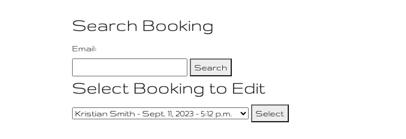
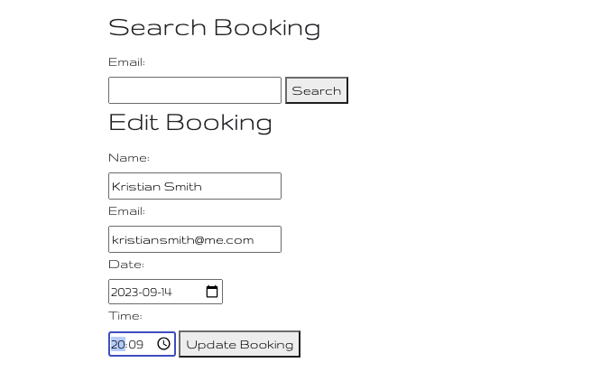
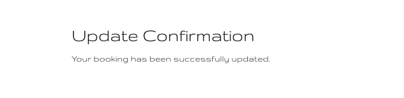
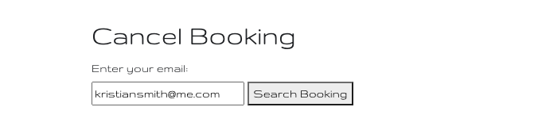
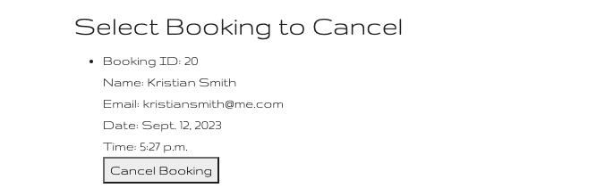
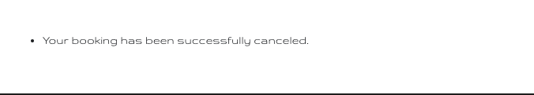
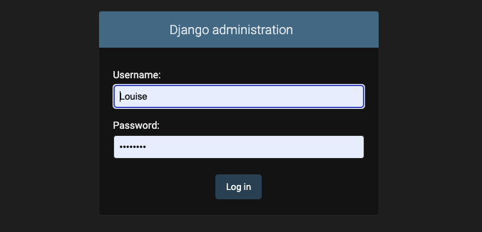
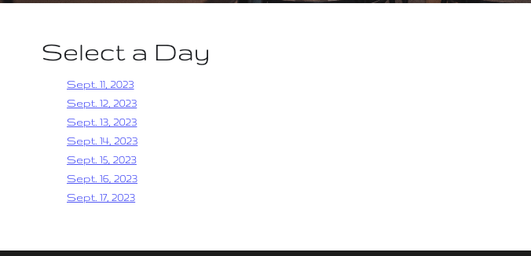
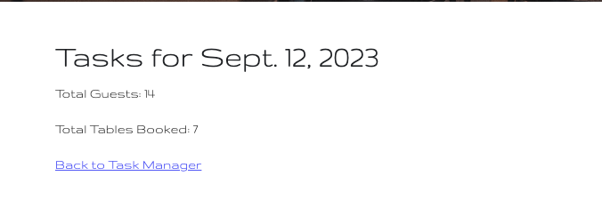

# Street Gastro Restaraunt Booking App

## Manual Testing

- Testing was done throughout site development, for each feature before it was merged into the master file.

- Usability was tested with the below user acceptance testing, sent to new users to ensure testing from different users, on different devices and browsers to ensure issues - were caught and where possible fixed during development.

- Book, Edit, Cancel bookings from booking form.

- Booking confirmed.
  

- Search booking with email.
  

- Select booking.
  

- Edit booking.
  

- Edit booking confirmed.
  

- Search booking to cancel.
  

- Select booking to cancel.
  

- Booking canceled.
  

- Staff/manager task manger login.
  

- Staff/manager select date.
  

- Staff/manager guests and tables booked for the day.
  

## Automated testing

### Django unit testing

Django unit testing is a framework that allows you to write tests for your Django application. It is a good way to test your application's functionality and to make sure that your code is working as expected. 

## Validation

### HTML Validation:

- HTML validation was done by using the official [W3C](https://validator.w3.org/) validator. This checking was done manually by copying the view page source code (Ctrl+U) and pasting it into the validator.

- [HTML Validation Report](static/images/w3-html-validation.png)

- there was no eras or warnings shown.

### CSS Validation:

- [Full CSS Validation Report](documentation/validation/css_validation.png)

- No errors or warnings were found when passing through the official [W3C (Jigsaw)](https://jigsaw.w3.org/css-validator/#validate_by_uri) validator except for the warnings about the use of css root variables and webkit css rules for the box-shadow. However, css code works perfectly on various devices.

---
## Lighthouse Report

- [Full Lighthouse Report](static/images/lighthouse.png)

- Lighthouse report was generated for every pages, using Chrome Dev Tools.

---